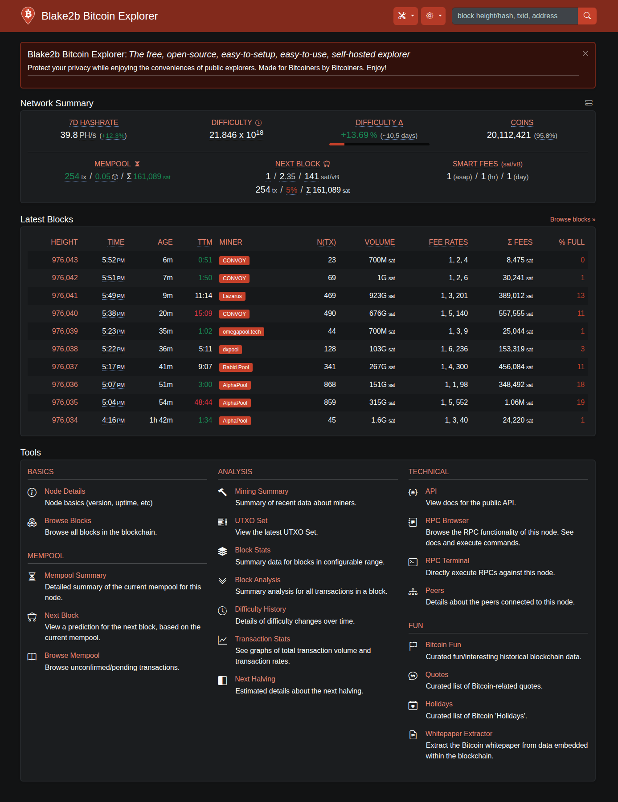

# BTC RPC Explorer: Blake2b fork

## Self-hosted explorer for the BLAKE2b chain of [Bitcoin Knots](https://github.com/bitcoinknots/bitcoin).



This is a self-hosted explorer driven by RPC calls to your own Bitcoin Knots node. It is a fork of [BTC RPC Explorer](https://github.com/janoside/btc-rpc-explorer) by Dan Janosik (MIT license), adapted to the chain that Knots follows since its BLAKE2b hard fork. It is easy to run and lacks some features compared to database-backed explorers.

Whatever reasons you may have for running a full node (trustlessness, technical curiosity, supporting the network, etc) it's valuable to appreciate the *fullness* of your own node. With this explorer you can explore the blockchain, and also the functional capabilities of your own node.


# What is different from upstream

* Reads `difficulty_blake2b` as well as `difficulty` (Knots reports the former for BLAKE2b blocks).
* Sends the `blake2b` rule with `getblocktemplate`, which Knots requires on this chain.
* The block page shows the extended BLAKE2b header fields (`nonce2`, `nonce3`, extranonce, time offset, flags).
* The difficulty history keeps SHA-256d and BLAKE2b difficulty apart, because they are on different scales and cannot be compared.
* No hashrate is reported for a window that reaches back before the fork, for the same reason.
* The node details page shows the BLAKE2b fork height and whether it has taken effect.
* A hand-maintained list identifies the miners seen on this chain (`public/txt/mining-pools-configs-custom/`).
* Red theme and the Blake2b name.

Blocks up to the fork are shared with Bitcoin. From the fork on, blocks use BLAKE2b proof of work and difficulty is the expected number of hashes per block.


# Features

* Network summary dashboard
* View details of blocks, transactions, and addresses
* Analysis tools for viewing stats on blocks, transactions, and miner activity
* JSON REST API
* See raw JSON content from bitcoind used to generate most pages
* Search by transaction ID, block hash/height, and address
* Optional transaction history for addresses by querying an Electrum-protocol server (e.g. Fulcrum, Electrs, ElectrumX)
* Mempool summary, with fee, size, and age breakdowns
* RPC command browser and terminal


# Changelog / Release notes

See [CHANGELOG.md](/CHANGELOG.md) (upstream's history).


# Getting started

## Prerequisites

1. A Bitcoin Knots node on the BLAKE2b chain (v29.4.2 or later), with its RPC server enabled (`server=1`).
2. Let the node synchronize (you *can* use this tool while synchronizing, but some pages may fail).
3. Node.js 20+ (22+ recommended).
4. Optional, for address history: an Electrum-protocol server for the same chain, such as a Fulcrum build that follows it.

### Note about pruning and indexing

This tool works best with full transaction indexing enabled (`txindex=1`) and pruning **disabled**. You can run without `txindex` and/or with pruning, and the tool will continue to function, but some data will be incomplete or missing.

With pruning enabled and/or `txindex` disabled:

* You will only be able to search for mempool, recently confirmed, and wallet transactions by their txid.
* Pruned blocks will display basic header information, without the list of transactions.
* The address and amount of previous transaction outputs will not be shown, only the txid:vout.
* The mining fee will only be available for unconfirmed transactions.


## Install / Run

```bash
git clone https://github.com/2rdzy/btc-rpc-explorer
cd btc-rpc-explorer
npm ci
npm run build
npm start
```

The app is then at [http://127.0.0.1:3002/](http://127.0.0.1:3002/). Views are cached, so restart after editing a template.

The code runs from `dist/`, which `npm run build` compiles with TypeScript. **Run `npm run build` again after every update** (and after `npm run css`), then restart. `npm ci` installs the dev dependencies the build needs; to keep a smaller install, build first and then run `npm prune --omit=dev`. Errors show the original source file and line, because `npm start` runs Node with `--enable-source-maps`.


## Configuration

Set options with environment variables or CLI arguments.

#### Environment variables

Create one of these files and enter values in it:

1. `~/.config/btc-rpc-explorer.env`
2. `.env` in the working directory

See [.env-sample](.env-sample) for all options. A typical `.env` for a local node with cookie authentication and a Fulcrum server:

```
BTCEXP_HOST=127.0.0.1
BTCEXP_PORT=3002

BTCEXP_BITCOIND_HOST=127.0.0.1
BTCEXP_BITCOIND_PORT=8332
BTCEXP_BITCOIND_COOKIE=/path/to/.cookie

BTCEXP_ADDRESS_API=electrum
BTCEXP_ELECTRUM_SERVERS=tls://your-fulcrum-host:50002
BTCEXP_ELECTRUM_TXINDEX=true
```

Notes:

* The cookie file is regenerated every time bitcoind restarts. Copy it again after a restart.
* The Electrum client does not verify the server's TLS certificate (so self-signed Fulcrum certificates work). Only use it with a server you trust on a network you trust.
* To use a node on another machine without opening its RPC port, forward it over SSH: `ssh -N -L 8332:127.0.0.1:8332 user@node-host`, then point `BTCEXP_BITCOIND_HOST` at `127.0.0.1`.

#### CLI arguments

Run `node dist/bin/cli.js --help` for the full list, for example:

```bash
node dist/bin/cli.js --port 8080 --bitcoind-port 8332 --bitcoind-cookie ~/.bitcoin/.cookie
```

#### Demo mode

`BTCEXP_DEMO=true` enables some demo behaviour: page size limits and an open RPC terminal. Do not enable it on a node you care about without reading the settings in [.env-sample](.env-sample).

#### SSO authentication

You can configure SSO authentication similar to what ThunderHub and RTL provide. To enable it, make sure `BTCEXP_BASIC_AUTH_PASSWORD` is **not** set and set `BTCEXP_SSO_TOKEN_FILE` to point to a file write-accessible by btc-rpc-explorer. Your SSO provider then needs to read the token from this file and set it in the URL parameter `token`. The token changes with each login, so the provider needs to read it each time.

After successful access with the token, a cookie is set for authentication. To redirect users to your login page when needed, set `BTCEXP_SSO_LOGIN_REDIRECT_URL`.


## Run via Docker

1. `docker build -t btc-rpc-explorer .`
2. `docker run -it -p 3002:3002 -e BTCEXP_HOST=0.0.0.0 btc-rpc-explorer`

See also [docker-compose.yml](docker-compose.yml) and [docs/Server-Setup-Docker.md](docs/Server-Setup-Docker.md).


## Reverse proxy with HTTPS

See [docs/nginx-reverse-proxy.md](docs/nginx-reverse-proxy.md) for nginx and certbot (Let's Encrypt), and [docs/Server-Setup.md](docs/Server-Setup.md) for a full server walkthrough.


## Development

* `npm test` runs the tests (TypeScript modules are loaded with `tsx`), `npm run lint` runs ESLint (with typescript-eslint for `.ts` files), and `npm run typecheck` type-checks everything with TypeScript. CI runs all three, and builds.
* **TypeScript.** The application is written in TypeScript: `app.ts`, `routes/`, `bin/www.ts`, `bin/cli.ts` and everything in `app/` except the data files below. **`.ts` files are checked with `strict` and with no tolerance** (`tsconfig.strict.json`), so they are fully typed. What the node returns is JSON that varies by RPC method and node version, so it is typed loosely as `RpcData` (`app/api/rpcApi.ts`) and the types get tighter where a use needs it. Shared helpers are in `app/helpers/`, and `app/utils.ts` re-exports them for the code that has always imported from there. Two things to know about the order of imports: `app.ts` and `bin/cli.ts` run code between their imports on purpose (the `.env` files and command line settings must be in the environment before `config` loads), and `tsc` keeps the imports where they are written, so do not sort them.
* What remains JavaScript is data and tooling: `app/coins.js`, `app/coins/` (coin parameters, quotes, holidays), `app/currencies.js`, `app/resourceIntegrityHashes.js` (generated by `npm run css`), `docs/api.js` and the scripts in `bin/` that are run directly with `node`. It is type-checked with JSDoc comments and `noImplicitAny` (`tsconfig.json`): new code there must declare its parameter and variable types, for example `/** @param {string} name */`. `typecheck-baseline.txt` lists findings that existed before the checks were added; it is empty now, and only *new* findings fail, so do not add to it.
* Tests and the type check run on the source. The app itself runs from `dist/`: `npm run build && npm start`. Files that are not code (`views/`, `public/`, the changelogs) are read from the project root, found by `app/paths.js`, so do not use `__dirname` to reach them.
* `npm run css` rebuilds the three theme stylesheets from `public/scss/` and rewrites the integrity hashes in `app/resourceIntegrityHashes.js`. Commit the compiled `*.min.css` files and the hashes together, or browsers will reject the stylesheets.
* `npm run miners` downloads the upstream mining pool lists. It does not touch `public/txt/mining-pools-configs-custom/`.


# License

MIT. See [LICENSE](LICENSE). Original work by Dan Janosik.
